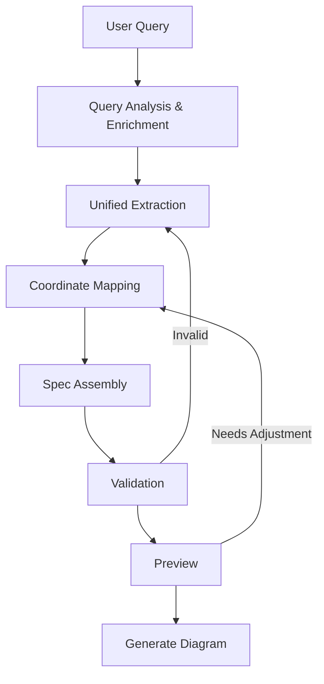

# Hockey Diagram Generation Pipeline v2
## Structured Pipeline with MCP Tool Support

## Pipeline Overview



## Revised Pipeline Stages

### Stage 0: User Query
**Input**: Natural language hockey terms
```
"2v1 rush from neutral zone with shot on goal"
```

### Stage 1: Query Analysis & Enrichment
**Tool**: `analyze_and_enrich_query`
**Purpose**: Parse hockey notation and expand implicit information
```json
{
  "original": "2v1 rush from neutral zone with shot on goal",
  "enriched": {
    "drill_type": "2v1_rush",
    "player_count": {"offensive": 2, "defensive": 1},
    "starting_zone": "neutral",
    "ending_zone": "offensive",
    "key_actions": ["rush", "pass", "shot"],
    "implicit_positions": {
      "F1": "neutral zone left",
      "F2": "neutral zone right", 
      "D1": "offensive blue line center"
    },
    "implicit_movements": [
      "F1 and F2 rush from neutral to offensive zone",
      "Pass between F1 and F2",
      "Shot on goal"
    ]
  }
}
```

### Stage 2: Unified Extraction (Single LLM Call)
**Tool**: `extract_drill_components`
**Purpose**: Extract ALL components in one structured LLM call
```json
{
  "players": [
    {"id": "F1", "role": "forward", "team": "home", "starting_position": "neutral zone left"},
    {"id": "F2", "role": "forward", "team": "home", "starting_position": "neutral zone right"},
    {"id": "D1", "role": "defense", "team": "away", "starting_position": "offensive blue line center"}
  ],
  "movements": [
    {"type": "skate", "player": "F1", "from": "start", "to": "offensive left slot", "style": "rush"},
    {"type": "skate", "player": "F2", "from": "start", "to": "offensive right slot", "style": "rush"},
    {"type": "pass", "from": "F1", "to": "F2", "timing": "at_blue_line"},
    {"type": "shot", "player": "F2", "target": "net"}
  ],
  "rink_view": "full",
  "equipment": ["pucks"],
  "zones": ["highlight_neutral_to_offensive"]
}
```

### Stage 3: Coordinate Mapping
**Tool**: `map_components_to_coordinates`
**Purpose**: Convert positions to exact coordinates
```json
{
  "players": [
    {"id": "F1", "coordinates": {"x": 0, "y": 20}},
    {"id": "F2", "coordinates": {"x": 0, "y": -20}},
    {"id": "D1", "coordinates": {"x": 30, "y": 0}}
  ],
  "movements": [
    {
      "type": "skate",
      "from_pos": {"x": 0, "y": 20},
      "to_pos": {"x": 69, "y": 15},
      "waypoints": [[25, 18], [50, 16]]
    }
  ]
}
```

### Stage 4: Spec Assembly
**Tool**: `assemble_diagram_spec`
**Purpose**: Combine all components into final spec
```json
{
  "rink": {"view": "full"},
  "players": [...],
  "movements": [...],
  "equipment": [...],
  "zones": [...],
  "annotations": [...]
}
```

### Stage 5: Validation
**Tool**: `validate_diagram_spec`
**Purpose**: Check hockey logic and spatial conflicts

### Stage 6: Preview
**Tool**: `preview_diagram`
**Purpose**: ASCII or coordinate preview for verification

### Stage 7: Generate
**Tool**: `generate_diagram`
**Purpose**: Create final SVG/PNG output

## Optimized Pipeline Design

### Option A: 4-Step Streamlined Pipeline
```
1. analyze_query -> Enriched understanding
2. extract_and_map -> Single LLM call with coordinate mapping
3. validate_and_preview -> Combined validation with preview
4. generate_diagram -> Final output
```

### Option B: 3-Step Minimal Pipeline
```
1. process_drill_request -> All-in-one extraction and mapping
2. preview_with_validation -> Show and validate
3. generate_diagram -> Final output
```

### Option C: 5-Step Balanced Pipeline (RECOMMENDED)
```
1. enrich_query -> Parse and expand query
2. extract_components -> Single LLM extraction
3. map_to_coordinates -> Deterministic coordinate mapping
4. validate_preview -> Check and show
5. generate_diagram -> Final output
```

## Proposed MCP Tools

### Tool 1: enrich_query
```python
@mcp.tool("enrich_query")
def enrich_query(query: str) -> Dict:
    """
    Parses hockey notation and enriches with implicit information.
    NO LLM required - uses pattern matching and rules.
    
    Input: "2v1 rush"
    Output: {
        "drill_type": "2v1_rush",
        "players_needed": {"offensive": 2, "defensive": 1},
        "typical_formation": "triangle",
        "common_movements": ["rush", "pass", "shot"]
    }
    """
```

### Tool 2: extract_components
```python
@mcp.tool("extract_components")
def extract_components(enriched_query: Dict) -> Dict:
    """
    Single LLM call to extract all drill components.
    Uses structured prompting for reliable extraction.
    
    Returns complete component specification.
    """
```

### Tool 3: map_to_coordinates
```python
@mcp.tool("map_to_coordinates")
def map_to_coordinates(components: Dict) -> Dict:
    """
    Deterministic mapping of positions to coordinates.
    NO LLM required - uses position database and rules.
    
    Handles relative positions and zone context.
    """
```

### Tool 4: validate_preview
```python
@mcp.tool("validate_preview")
def validate_preview(spec: Dict) -> Dict:
    """
    Validates hockey logic and generates preview.
    Returns validation results with ASCII preview.
    """
```

### Tool 5: generate_diagram
```python
@mcp.tool("generate_diagram")
def generate_diagram(spec: Dict) -> Dict:
    """
    Generates final diagram output.
    Returns file paths and metadata.
    """
```

## Why This Pipeline Works Better

### 1. Reduced LLM Calls
- Only 1 LLM call (extract_components) instead of 4-5
- Other steps use deterministic rules and pattern matching

### 2. Predictable Processing
- Each stage has clear input/output contracts
- Deterministic coordinate mapping removes ambiguity
- Validation catches issues early

### 3. Improved Reliability
- Query enrichment provides context for LLM
- Single extraction reduces chance of inconsistencies
- Coordinate mapping uses tested position database

### 4. Agent-Friendly
- 5 steps is manageable for agents
- Clear success/failure at each stage
- Can retry specific stages if needed

## Implementation Priority

1. **Phase 1**: Build enrich_query and map_to_coordinates (no LLM needed)
2. **Phase 2**: Create extract_components with structured prompting
3. **Phase 3**: Combine validate_preview for efficiency
4. **Phase 4**: Polish generate_diagram output

## Example Flow

### Input
```
"Create a 2v1 drill where forwards attack from center ice"
```

### Stage 1: Enrich
```json
{
  "drill_notation": "2v1",
  "offensive_players": 2,
  "defensive_players": 1,
  "starting_zone": "neutral",
  "drill_category": "rush",
  "suggested_ending": "shot_on_goal"
}
```

### Stage 2: Extract (LLM)
```json
{
  "players": [
    {"id": "F1", "type": "forward", "team": "home", "position_desc": "center ice left"},
    {"id": "F2", "type": "forward", "team": "home", "position_desc": "center ice right"},
    {"id": "D1", "type": "defense", "team": "away", "position_desc": "offensive blue line"}
  ],
  "movements": [
    {"description": "F1 rushes to left slot"},
    {"description": "F2 rushes to right slot"},
    {"description": "F1 passes to F2"},
    {"description": "F2 shoots on net"}
  ]
}
```

### Stage 3: Map
```json
{
  "players": [
    {"id": "F1", "x": 0, "y": 10},
    {"id": "F2", "x": 0, "y": -10},
    {"id": "D1", "x": 30, "y": 0}
  ],
  "movements": [
    {"from": [0, 10], "to": [69, 20]},
    {"from": [0, -10], "to": [69, -20]},
    {"type": "pass", "from": [69, 20], "to": [69, -20]},
    {"type": "shot", "from": [69, -20], "to": [89, 0]}
  ]
}
```

### Stage 4: Validate & Preview
```
   Offensive Zone
   
      . . . G . . .
     /             \
    |   D1          |
    |       *       |
    | F1        F2  |
    |   ↘    ↙     |
    |     \ /       |
    |      X        |
     \             /
      
✓ Valid: 2v1 formation correct
✓ Valid: Movements make hockey sense
```

### Stage 5: Generate
```
Output: drill_diagram_2v1_rush.svg
Status: Success
```

## Conclusion

This revised pipeline:
- Reduces complexity from 8+ steps to 5
- Minimizes LLM calls to just 1
- Provides clear, testable stages
- Maintains flexibility while improving reliability
- Is manageable for both direct use and agent orchestration