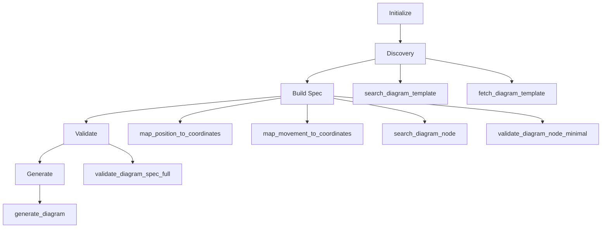

# Hockey Diagram MCP v2 - Technical Design Document

## Overview

The Hockey Diagram MCP v2 is an enhanced Model Context Protocol server that provides 11 focused tools for generating programmatic hockey tactical diagrams. Built following the n8n pattern for clarity and reduced cognitive load, it transforms natural language drill descriptions into precise SVG/PNG diagrams. Version 2.2 adds preview capabilities and relative positioning support.

## Architecture

### Core Components

```
hockey_diagram_mcp_v2.py (~1050 lines) - Main MCP server with preview
├── diagram_schemas.py (209 lines) - Schema definitions and enums
├── diagram_examples.py (330 lines) - Examples and patterns for each node type
├── position_mapper.py (334 lines) - Enhanced with relative positioning
├── validators.py (91 lines) - Validation logic
└── src/
    ├── drill_utilities.py - Core drill utilities
    ├── drill_template_finder.py - Template matching
    ├── hockey_diagram_builder.py - SVG generation
    ├── spec_converter.py - Spec conversion
    └── auto_trace_logger.py - Session tracking
```

### Coordinate System

- **X-axis**: -100 (left) to 100 (right)
- **Y-axis**: -42.5 (bottom) to 42.5 (top)
- **Origin**: Center ice (0, 0)
- **Zones**:
  - Offensive: x < -25
  - Neutral: -25 ≤ x ≤ 25
  - Defensive: x > 25

## Tool Inventory

### 1. initialize_diagram
**Purpose**: Start a new diagram generation session  
**Input**: `drill_request` (string) - Natural language drill description  
**Output**: Session ID, workflow instructions, tool sequence  
**Usage**: Always call first to establish context

### 2. search_diagram_node
**Purpose**: Get schema, examples, and patterns for spec nodes  
**Input**: `node_type` (string) - players|movements|rink|zones|annotations  
**Output**: Schema, enums, comprehensive examples, common patterns  
**Enhanced**: Now includes real-world examples and coordinate references  
**Usage**: Reference during spec building

### 3. search_diagram_template
**Purpose**: Find matching drill templates  
**Input**: `query` (string), `template_type` (optional), `limit` (int)  
**Output**: Matching templates with confidence scores  
**Usage**: Discovery phase to find patterns

### 4. fetch_diagram_template
**Purpose**: Get complete template JSON  
**Input**: `template_name` (string)  
**Output**: Full template specification  
**Usage**: Load template as starting point

### 5. validate_diagram_node_minimal
**Purpose**: Validate single spec node  
**Input**: `node_type` (string), `node_data` (object)  
**Output**: Validation results with issues and fixes  
**Usage**: Validate as you build

### 6. validate_diagram_spec_full
**Purpose**: Complete spec validation  
**Input**: `spec` (object), `original_request` (string)  
**Output**: Structure, spatial, and hockey sense validation  
**Usage**: Final validation before generation

### 7. preview_diagram
**Purpose**: Preview diagram as ASCII art or coordinate list  
**Input**: `spec` (object), `format` (string: "ascii"|"coordinates")  
**Output**: ASCII representation or structured coordinate list  
**NEW**: Added in v2.2 for quick validation before generation  
**Usage**: Check positioning before final generation

### 8. generate_diagram
**Purpose**: Create SVG/PNG output  
**Input**: `spec` (object), `output_name` (string)  
**Output**: File paths, execution trace  
**Usage**: Final step to produce diagram

### 9. map_position_to_coordinates
**Purpose**: Convert natural language or relative positions to coordinates  
**Input**: `position` (string), `zone` (string), `reference_positions` (dict)  
**Output**: Exact coordinates with positioning type  
**Enhanced**: Now supports relative positioning like "5 units left of F1"  
**Usage**: Player placement with relative positioning

### 10. map_movement_to_coordinates
**Purpose**: Generate movement specs with waypoints  
**Input**: `from_position`, `to_position`, `movement_type`, `pattern`, `zone`  
**Output**: Complete movement specification  
**Usage**: Create realistic movement paths

### 11. tools_health_check
**Purpose**: System status and statistics  
**Output**: Health status, available resources  
**Usage**: Debugging and monitoring

## Workflow Pattern



## Data Structures

### Player Specification
```json
{
  "type": "forward|defense|goalie|coach",
  "position": "F1|F2|F3|D1|D2|G",
  "team": "home|away",
  "has_puck": true|false,
  "coordinates": {"x": -50, "y": 0},
  "label": "optional label"
}
```

### Movement Specification
```json
{
  "type": "skate|pass|shot|carry|pressure",
  "from_pos": {"x": -50, "y": 0},
  "to_pos": {"x": -69, "y": 22.5},
  "style": "solid|dashed|dotted|wavy",
  "waypoints": [{"x": -60, "y": 10}],
  "label": "optional label"
}
```

### Complete Diagram Spec
```json
{
  "players": [...],
  "movements": [...],
  "rink": {"view": "offensive"},
  "zones": [...],
  "annotations": [...]
}
```

## Position Mapping

### Offensive Zone Landmarks
- Faceoff dots: (-69, ±22.5)
- Net front: (-86, 0)
- Slot: (-69, 0)
- High slot: (-50, 0)
- Corners: (-89, ±36)
- Points: (-25, ±20)

### Movement Patterns
- **direct**: Straight line, no waypoints
- **cross_ice**: S-curve with 2 waypoints
- **drive**: Curve to net avoiding defenders
- **cycle**: Follow boards
- **rush**: Speed through neutral zone
- **weave**: Agility pattern with lateral movement

## Validation Layers

### 1. Schema Validation
- JSON schema compliance
- Required fields presence
- Type checking
- Range validation

### 2. Spatial Validation
- Player overlap detection (min 5 units)
- Boundary checking
- Zone placement

### 3. Hockey Sense Validation
- Max 6 players per team
- Single puck possession
- Realistic positioning
- Movement patterns

## Error Handling

### Common Issues
1. **Missing coordinates**: Returns position suggestions
2. **Player overlap**: Reports distance and positions
3. **Invalid movement**: Suggests waypoints for cross-ice
4. **No puck holder**: Warning (may be intentional)

### Recovery Strategies
- Fuzzy position matching with LLM fallback
- Auto-pattern detection for movements
- Default zone centers for unknown positions
- Suggested fixes in validation responses

## Performance Optimizations

### Modular Design
- Separated schemas (208 lines)
- Extracted position mapping (192 lines)
- Isolated validation logic (91 lines)
- Reduced main file by ~200 lines

### Lazy Loading
- OpenAI client loaded on demand
- Templates loaded when needed
- Session tracking optional

### Caching
- Position mappings in dictionaries
- Template patterns pre-indexed
- Standard positions constant

## Integration Points

### MCP Protocol
- FastMCP framework
- Stateless HTTP support
- SSE/stdio transport options

### External Dependencies
- OpenAI API (optional LLM validation)
- Google Sheets (trace upload)
- Hockey knowledge base (research)

### Output Formats
- SVG (vector graphics)
- PNG (raster images)
- JSON (diagram specification)
- Trace logs (session data)

## Testing Strategy

### Unit Tests
```python
# Test position mapping
pos = map_position('left faceoff dot', 'offensive')
assert pos == (-69, 22.5)

# Test waypoint calculation
waypoints = calculate_waypoints(from_pos, to_pos, 'cross_ice')
assert len(waypoints) == 2

# Test validation
result = validate_node('players', player_data)
assert result['valid'] == True
```

### Integration Tests
- Full workflow from request to diagram
- Template matching accuracy
- Validation chain completeness
- File generation success

## New Features in v2.2

### Enhanced Examples & Patterns
- `search_diagram_node` now returns comprehensive examples
- Common patterns for each node type
- Real-world coordinate references
- Best practice tips

### Preview Capabilities
- ASCII art preview for quick visual check
- Coordinate list for detailed review
- Helps validate before generation
- Reduces iteration cycles

### Relative Positioning
- Support for "X units left/right/above/below of REF"
- "between REF1 and REF2" positioning
- Fractional positioning ("2/3 of the way from...")
- "near/close to" fuzzy positioning
- Enables dynamic layouts

## Future Enhancements

### Planned Features
1. Multi-phase drill support
2. Animation sequences
3. Coaching notes overlay
4. Formation presets
5. Drill progression tracking

### Extensibility Points
- New movement patterns in position_mapper
- Additional schemas in diagram_schemas
- Custom validators in validators.py
- Template expansion in drill_template_finder

## Deployment

### Requirements
- Python 3.8+
- Virtual environment (spacy_env)
- MCP server infrastructure
- Optional: OpenAI API key

### Configuration
```bash
# Standalone
python hockey_diagram_mcp_v2.py --transport stdio

# SSE Server
python hockey_diagram_mcp_v2.py --transport sse --port 8001
```

### Monitoring
- Health check endpoint
- Session tracking
- Error logging
- Performance metrics

## Maintenance

### Code Organization
- Clear separation of concerns
- Modular components
- Consistent naming
- Comprehensive logging

### Documentation
- Inline docstrings
- Schema examples
- Workflow instructions
- Error messages

### Version Management
- v2.2: Enhanced with preview and relative positioning
- v2.1: Added trace logging and modular design
- v2.0: Streamlined 8-tool design
- v1: Legacy monolithic version (archived)
- Semantic versioning for updates