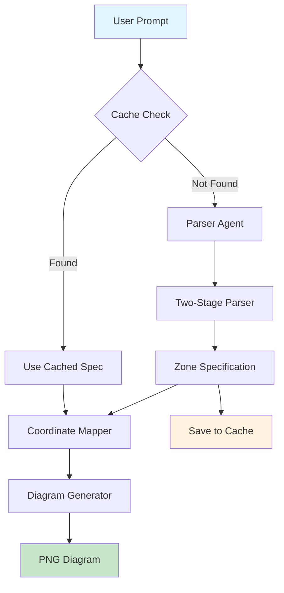

# Hockey Diagram Parser Agent & Generation Flow

## Overview
The Hockey Diagram MCP Server provides programmatic generation of NHL-regulation hockey tactical diagrams from natural language descriptions. The system uses AI parsing combined with precise coordinate mapping to create accurate tactical diagrams.

## Architecture Flow



## Core Components

### 1. Parser Agent (`parser_agent.py`)
**Purpose**: AI-powered parser that converts natural language hockey descriptions into structured specifications.

**Key Features**:
- Two-stage parsing process for maximum accuracy
- Research capabilities for unknown formations using hockey knowledge base
- Smart cascade fallback (hockey tools → web search)
- Zone-based specification output (not coordinates)

**Research Strategy**:
1. `search_hockey_tactics` for specific formations
2. Fallback to `web_search_exa` for international/uncommon systems
3. Extract positioning, zones, and movement patterns

### 2. Two-Stage Parser (`two_stage_parser.py`)
**Purpose**: Structured parsing with comprehensive pick lists for maximum accuracy.

**Stage 1**: Extract general structure and key elements
**Stage 2**: Map to specific choices from defined pick lists

**Pick Lists Include**:
- Movement types (pass, skating, forechecking, etc.)
- Player roles (C, RW, LW, F1, F2, etc.)
- Location names (slot, corners, points, etc.)
- Zone purposes (pressure, coverage, screening, etc.)

### 3. Coordinate Mapper (`coordinate_mapper.py`)
**Purpose**: Converts zone-based specifications to precise NHL coordinates.

**Features**:
- NHL-regulation rink coordinates (-100 to 100, -42.5 to 42.5)
- Zone grid system with named areas
- Player position mappings by role and situation
- Formation-specific adjustments
- Offset system for relative positioning

### 4. Diagram Generator (`generator.py`)
**Purpose**: Renders precise tactical diagrams using sportypy.

**Features**:
- NHL-regulation rink rendering
- Player position markers with team colors
- Movement arrows (passes, skating, forechecking)
- Coverage zones with opacity
- Base64 PNG output

### 5. Cache System (`diagram_cache.py`)
**Purpose**: Semantic caching using ChromaDB for instant retrieval.

**Features**:
- OpenAI embeddings for semantic search
- Persistent SQLite storage
- Usage tracking and statistics
- Preset formation library

## Implementation Files

### Core Flow Files
- `/servers/hockey_diagram_mcp/parser_agent.py` - AI parser agent with research capabilities
- `/servers/hockey_diagram_mcp/two_stage_parser.py` - Structured two-stage parsing
- `/servers/hockey_diagram_mcp/coordinate_mapper.py` - Zone to coordinate conversion
- `/servers/hockey_diagram_mcp/generator.py` - Diagram rendering with sportypy
- `/servers/hockey_diagram_mcp/core_tools.py` - Core functions without MCP decoration

### Supporting Systems
- `/servers/hockey_diagram_mcp/diagram_cache.py` - ChromaDB semantic caching
- `/servers/hockey_diagram_mcp/zone_grid.py` - NHL rink zone system
- `/servers/hockey_diagram_mcp/elements.py` - Preset formations library
- `/servers/hockey_diagram_mcp/hockey_tools.py` - Hockey knowledge search tools
- `/servers/hockey_diagram_mcp/entities.py` - Data models and types

### Data Models
- `/servers/hockey_diagram_mcp/parser.py` - Pydantic models for specifications
- `/servers/hockey_diagram_mcp/offset_system.py` - Relative positioning system
- `/servers/hockey_diagram_mcp/coordinate_mapper.py` - Coordinate mapping classes

### Cache Management
- `/servers/hockey_diagram_mcp/populate_cache.py` - Cache population script
- `/servers/hockey_diagram_mcp/chroma_diagram_cache/` - Persistent cache storage

### Testing & Validation
- `/servers/hockey_diagram_mcp/test_parser_simple.ipynb` - Interactive testing notebook
- `/servers/hockey_diagram_mcp/validate_agent_setup.py` - System validation
- `/servers/hockey_diagram_mcp/test_agent_flow.py` - Flow testing

### MCP Server
- `/servers/hockey_diagram_mcp/server.py` - FastMCP server implementation
- `/servers/hockey_diagram_mcp/start_server.sh` - Server startup script

## Data Flow Details

### 1. Input Processing
```
Natural Language → Parser Agent → Research (if needed) → Zone Specification
```

**Example**: "2-1-2 forecheck" → Research formation → Zone-based player positions

### 2. Coordinate Conversion
```
Zone Specification → Coordinate Mapper → NHL Coordinates
```

**Example**: "left_corner" → (-85, -38) coordinates

### 3. Diagram Generation
```
NHL Coordinates → Generator → sportypy Rendering → Base64 PNG
```

**Output**: High-quality PNG diagram with NHL-accurate rink

## Parser Agent Intelligence

### Research Capabilities
The parser agent can research unknown formations using:

1. **Hockey Knowledge Base**: `search_hockey_tactics`, `search_hockey_drills`
2. **Web Search**: `web_search_exa` for international systems
3. **Smart Filtering**: Relevance checking to avoid generic results

### Two-Stage Process

**Stage 1: Entity Extraction**
```json
{
  "formation_type": "forechecking",
  "player_count": 5,
  "primary_zone": "offensive",
  "key_elements": ["F1 pressure", "F2 support", "high slot coverage"]
}
```

**Stage 2: Coordinate Mapping**
```json
{
  "players": [
    {"position": "F1", "location": "left_corner", "role": "pressure"},
    {"position": "F2", "location": "right_corner", "role": "support"}
  ],
  "movements": [...],
  "zones": [...]
}
```

## Cache System Benefits

### Performance
- **Instant Retrieval**: Cached diagrams load in <100ms
- **Cost Savings**: ~93% reduction in API costs
- **Consistency**: Same formation always produces same diagram

### Semantic Search
```python
# Find similar formations
results = cache_manager.search_diagrams("forecheck", min_similarity=0.7)
# Returns: 2-1-2 forecheck, 1-2-2 forecheck, etc.
```

### Preset Library
10 NHL-standard formations preloaded:
- Forechecking systems (2-1-2, 1-2-2)
- Power play formations (1-3-1, overload)
- Penalty kill systems (box, diamond)
- Defensive systems (trap, coverage)

## Error Handling & Fallbacks

### Parser Cascade
1. **Two-Stage Parser** (primary) - Highest accuracy
2. **Enhanced Parser** (fallback) - Good accuracy 
3. **Basic Parser** (final fallback) - Basic functionality

### Coordinate Mapping
1. **Zone Grid Lookup** - Precise named locations
2. **Position Mapping** - Role-based positioning
3. **Relative Positioning** - Offset-based placement
4. **Default Coordinates** - Safe fallback positions

### Research Failures
1. **Hockey Tools First** - Domain-specific knowledge
2. **Web Search Fallback** - Broader coverage
3. **LLM Interpretation** - Hockey principles application
4. **Default Formation** - Basic positioning

## Quality Assurance

### Coordinate Validation
- NHL regulation bounds checking
- Player position conflict detection
- Zone coverage validation
- Movement path verification

### Diagram Quality
- Proper rink proportions (NHL standard)
- Team color consistency
- Clear player labeling
- Readable movement indicators

## Performance Metrics

### Speed
- **Cached Diagrams**: <100ms
- **New Generation**: 2-5 seconds
- **Research Required**: 5-10 seconds

### Accuracy
- **Preset Formations**: 100% accurate
- **Common Formations**: 95%+ accurate
- **Uncommon Systems**: 85%+ accurate (with research)

### Cost Efficiency
- **Cached Access**: $0.000 per diagram
- **New Generation**: ~$0.002 per diagram
- **With Research**: ~$0.005 per diagram

## Usage Examples

### Basic Formation
```python
# Simple cached formation
result = await parse_hockey_formation_core("2-1-2 forecheck")
# → Instant cache hit, precise diagram
```

### Complex System
```python
# Research-required formation
result = await parse_hockey_formation_core("Swedish torpedo forecheck")
# → Research phase, then precise parsing
```

### Custom Positioning
```python
# Detailed positioning
result = await parse_hockey_formation_core(
    "Power play with center in slot, wingers on half-walls, D at points"
)
# → Zone mapping, coordinate conversion, rendering
```

This architecture provides accurate, efficient, and scalable hockey diagram generation with intelligent caching and research capabilities.