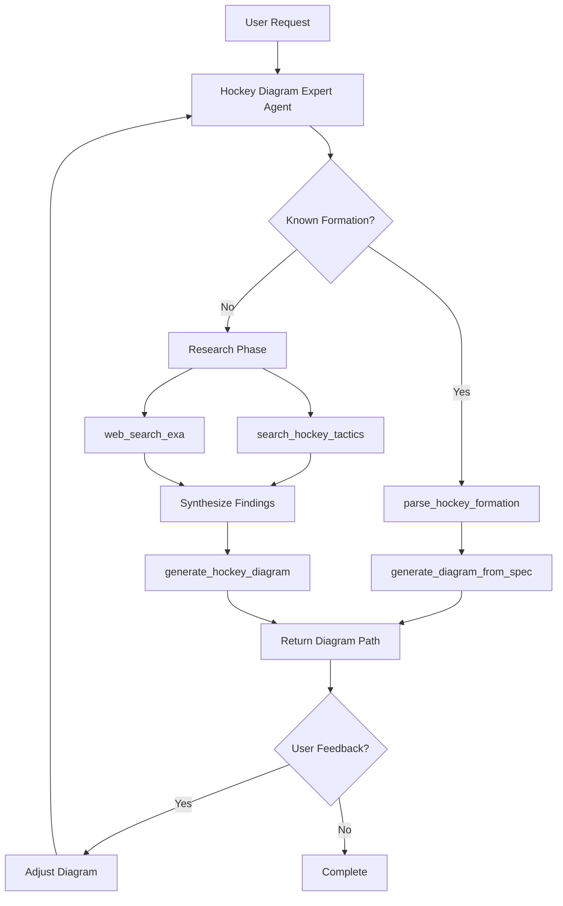

# Single Agent Architecture for Hockey Diagram Generation

## Overview

This document outlines the architecture for transitioning the hockey diagram generation system from a multi-component orchestrated approach to a unified single-agent architecture using the OpenAI Agents SDK.

## Key Principles

1. **Preserve Existing Work**: All existing components (two-stage parser, zone grid, generator) remain intact
2. **Agent as Orchestrator**: OpenAI Agent decides when and how to use each component
3. **Tool-Based Integration**: Existing functionality wrapped as tools for the agent
4. **Natural Language Flow**: Agent handles research, clarification, and iteration naturally

## Architecture Components

### 1. Core Agent: Hockey Diagram Expert

```python
# hockey_diagram_agent.py
from agents import Agent, Runner
from agents.mcp import MCPServerStdio

class HockeyDiagramExpert:
    """Single agent that orchestrates all hockey diagram generation."""
    
    def __init__(self):
        self.agent = None
        self.mcp_servers = []
        
    async def initialize(self):
        """Initialize the agent with all tools and MCP servers."""
        
        # Connect to MCP servers
        self.mcp_servers = [
            # Hockey knowledge base
            MCPServerStdio(
                command="python",
                args=["/path/to/servers/hockey_mcp.py"],
                name="hockey-coaching"
            ),
            # Web research
            MCPServerStdio(
                command="npx",
                args=["-y", "exa-mcp-server"],
                env={"EXA_API_KEY": os.getenv("EXA_API_KEY")},
                name="exa-search"
            ),
            # Diagram generation (wraps parser + generator)
            MCPServerStdio(
                command="/path/to/servers/hockey_diagram_mcp/start_server.sh",
                name="hockey-diagram"
            )
        ]
        
        # Create agent with comprehensive instructions
        self.agent = Agent(
            name="Hockey Diagram Expert",
            instructions=EXPERT_INSTRUCTIONS,
            mcp_servers=self.mcp_servers
        )
```

### 2. Wrapped Parser Tool

The existing two-stage parser becomes a tool within the hockey-diagram MCP server:

```python
# In server.py, add new tool alongside generate_hockey_diagram

@server.tool("parse_hockey_formation")
async def parse_hockey_formation(
    prompt: str,
    return_structured: bool = True
) -> dict:
    """
    Parse a hockey formation using the two-stage parser.
    Returns structured data ready for diagram generation.
    """
    try:
        parser = TwoStageHockeyParser()
        diagram_spec = await parser.parse_prompt(prompt)
        
        if return_structured:
            return {
                "success": True,
                "formation": diagram_spec.formation,
                "players": diagram_spec.players,
                "movements": diagram_spec.movements,
                "zones": diagram_spec.zones,
                "view": diagram_spec.view
            }
        else:
            return {
                "success": True,
                "raw_spec": diagram_spec.dict()
            }
    except Exception as e:
        return {
            "success": False,
            "error": str(e),
            "error_type": type(e).__name__
        }

@server.tool("generate_diagram_from_spec")
async def generate_diagram_from_spec(
    diagram_spec: dict,
    output_format: str = "png"
) -> dict:
    """
    Generate a diagram from a parsed specification.
    Separates parsing from generation for agent flexibility.
    """
    try:
        generator = HockeyDiagramGenerator()
        # Use existing zone grid integration
        result = generator.generate_from_spec(DiagramSpec(**diagram_spec))
        
        filepath = save_diagram(result, output_format)
        
        return {
            "success": True,
            "diagram_path": str(filepath),
            "message": f"Diagram generated: {filepath}"
        }
    except Exception as e:
        return {
            "success": False,
            "error": str(e)
        }
```

### 3. Agent Instructions

```python
EXPERT_INSTRUCTIONS = """
You are a Hockey Diagram Expert that creates precise NHL-regulation tactical diagrams.

## Your Capabilities:
1. **Parse Known Formations**: Use parse_hockey_formation for standard formations
2. **Research Unknown Concepts**: Use hockey-coaching search and web search
3. **Generate Diagrams**: Create visual representations with accurate positioning
4. **Iterate and Refine**: Handle feedback and adjustments

## Process Flow:
1. ALWAYS try parse_hockey_formation first for efficiency
2. If parsing fails with "unknown formation", research using:
   - search_hockey_tactics for hockey-specific knowledge
   - web_search_exa for novel or international variations
3. Generate diagram using either:
   - generate_hockey_diagram for direct generation
   - generate_diagram_from_spec for pre-parsed specifications
4. Handle user feedback for adjustments

## Standards:
- Use NHL regulation rink dimensions
- Standard position notation: C, RW, LW, LD, RD, G
- Zone-based positioning (32 zones: defensive, neutral, offensive)
- Maintain consistent colors: Home (blue), Away (red)

## Example Interactions:
- "2-1-2 forecheck" → Parse directly, instant result
- "Swedish box play" → Research if unknown, then generate
- "Make F1 more aggressive" → Adjust previous diagram
"""
```

### 4. Integration Flow



## Implementation Plan

### Phase 1: Tool Wrapping (Day 1)
1. Add `parse_hockey_formation` tool to server.py
2. Add `generate_diagram_from_spec` tool for separation of concerns
3. Test tools independently via MCP

### Phase 2: Agent Creation (Day 2)
1. Create `hockey_diagram_agent.py` with HockeyDiagramExpert class
2. Write comprehensive agent instructions
3. Connect all MCP servers
4. Implement error handling and retry logic

### Phase 3: Integration (Day 3)
1. Add agent-based endpoint to main MCP server
2. Create `generate_with_agent` tool that uses the agent
3. Maintain backward compatibility with direct generation

### Phase 4: Testing & Refinement (Day 4-5)
1. Test known formation fast path
2. Test unknown formation research flow
3. Test iterative refinement capabilities
4. Performance benchmarking

## File Structure Changes

```
servers/hockey_diagram_mcp/
├── server.py                    # Add new tools (parse, generate_from_spec)
├── hockey_diagram_agent.py      # NEW: Agent implementation
├── agent_instructions.py        # NEW: Detailed agent instructions
├── two_stage_parser.py         # No changes - wrapped as tool
├── generator.py                # No changes - uses zone grid
├── zone_grid.py               # No changes - Wave 1 implementation
├── coordinate_mapper.py        # No changes - Wave 1 updates
└── test_agent_flow.py         # NEW: Agent-specific tests
```

## Key Benefits

1. **Simplicity**: Single entry point for all diagram generation
2. **Intelligence**: Agent decides optimal path automatically
3. **Flexibility**: Natural handling of unknown concepts
4. **Iteration**: Built-in conversation memory for refinements
5. **Extensibility**: Easy to add new tools without changing flow

## Backward Compatibility

The existing `generate_hockey_diagram` tool remains unchanged. Users can choose:
- Direct generation: Fast, deterministic, requires known formations
- Agent generation: Intelligent, research-capable, handles any request

## Example Usage

```python
# Direct API usage
result = await agent.run(
    "Create a Finnish 1-2-2 forecheck with aggressive F1"
)
# Agent researches Finnish variation, generates accurate diagram

# With feedback
result = await agent.run(
    "Move the wingers higher in the zone"
)
# Agent adjusts previous diagram based on context
```

## Migration Path

1. **No Breaking Changes**: All existing functionality remains
2. **Opt-in Agent**: Users choose when to use agent vs direct
3. **Gradual Adoption**: Can migrate specific use cases over time
4. **Performance Monitoring**: Track agent vs direct performance

## Success Metrics

- Known formations: <100ms overhead vs direct parsing
- Unknown formations: Successful research and generation
- Iteration success: 90%+ accurate adjustments
- User satisfaction: Reduced need for manual corrections

## Future Enhancements

1. **Learning**: Agent remembers coach preferences
2. **Templates**: Agent suggests similar formations
3. **Analysis**: Agent explains tactical advantages
4. **Export**: Multiple format support (video, animation)

This architecture preserves all existing work while providing a dramatically simpler and more capable interface for hockey diagram generation.